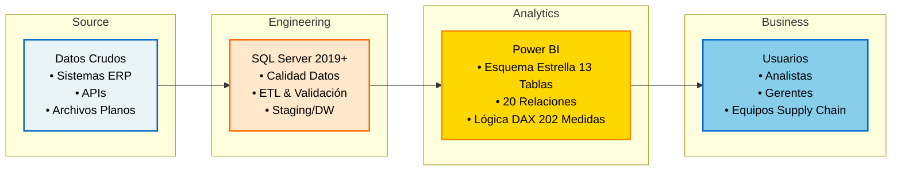
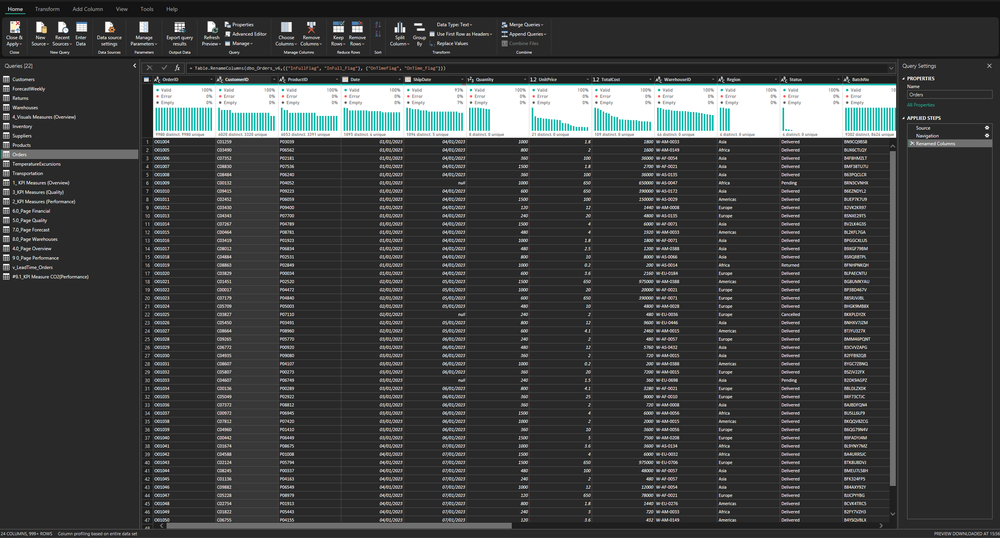
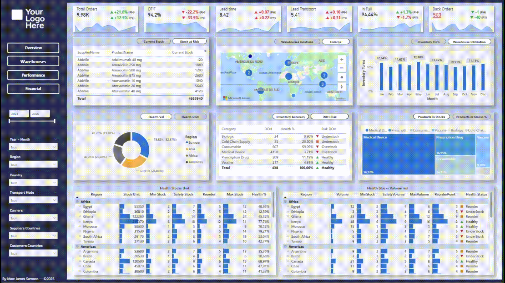

## PHARMA LOGISTICS - Panel de Control Power BI
#### Por [Marc James Samson](https://www.linkedin.com/in/samson18/)

---

---

### DESCRIPCIÓN GENERAL

**Pharma Logistics BI** es un panel de control integral de gestión de cadena de suministro farmacéutica construido con Power BI. Ofrece visibilidad en tiempo real de pedidos, transporte, inventario, cumplimiento de calidad y desempeño financiero en múltiples regiones y proveedores logísticos.

Diseñado para gerentes de cadena de suministro, coordinadores logísticos y analistas financieros para monitorear KPI, identificar cuellos de botella y optimizar las operaciones de distribución farmacéutica.

### FUNDACIÓN DE DATOS Y GOBERNANZA

Este proyecto demuestra las prácticas de ingeniería de datos de nivel empresarial aplicadas a la analítica de cadena de suministro farmacéutica:

**Ingeniería de Datos:**

- Fuente: Conjunto de datos completamente diseñado y arquitecturado desde cero siguiendo las mejores prácticas de la industria
- Capa de Datos: Importada en SQL Server 2019+ para transformación y validación rigurosa usando restricciones y relaciones
- Procesamiento Ascendente: Todas las limpiezas de datos, enriquecimientos y validaciones de calidad se realizan a nivel SQL antes de llegar a Power BI. Siguiendo el principio: "Realiza transformaciones de datos lo más aguas arriba (cercano a la fuente) posible, y solo aguas abajo (en el informe) si es necesario" (Maxim de Roche). Esto asegura integridad de datos, mantiene una única fuente de verdad y optimiza el desempeño del informe.

- Reglas de validación estandarizadas aplicadas durante ETL
- **13 tablas de datos con 20 relaciones** (arquitectura de esquema de estrella)
- 202 medidas calculadas para definiciones de KPI consistentes

Este enfoque ascendente garantiza integridad de datos en más de 822,000+ registros cubriendo 4 regiones, 44 países, 44 almacenes y 2,535 clientes globalmente.

---

### Diagrama de Arquitectura

---

### &nbsp;&nbsp;Arquitectura de Base de Datos

El sistema está construido sobre una base de datos SQL Server 2019+ con **13 tablas**, donde todas las limpiezas de datos, transformaciones, cálculos de negocio, restricciones de integridad referencial y definiciones de relaciones se aplican en la capa de datos. Esta arquitectura upstream-first garantiza la consistencia de los datos, elimina el procesamiento redundante en la capa analítica y optimiza el rendimiento general.

[Ver DATABASE_SCHEMA.md completo](docs/DATABASE_SCHEMA.md) | [Diccionario de Datos](docs/DATA_DICTIONARY.md)

---

###  &nbsp;&nbsp;Power Query

---

###  &nbsp;&nbsp;Diagrama del Esquema de Base de Datos

El diagrama anterior ilustra el modelo de datos completo con todas las relaciones de entidades, incluyendo Pedidos, Envíos, Inventario, Almacenes, Transportistas, Productos y Transacciones.

---

### PÁGINAS DEL PANEL DE CONTROL

&nbsp;&nbsp;**DESCRIPCIÓN GENERAL** - Panel de Control de Desempeño Global

---

&nbsp;&nbsp;**DESEMPEÑO** - Analítica de Cadena de Suministro

---

&nbsp;&nbsp;**ALMACENES** - Optimización de Inventario

---

&nbsp;&nbsp;**FINANCIERO** - Rentabilidad y Economía

---

### KPI POR CATEGORÍA

### Descripción General Rápida de KPI

### KPI Clave de Transporte
*Métricas que rastrean eficiencia de transporte, desempeño logístico y sostenibilidad operativa.*

| Nombre del KPI | Descripción | Alcance |
| :--- | :--- | :--- |
| **OTIF %** | Tasa de Entrega a Tiempo y Completa | 🌍 Global |
| **Tiempo de Entrega** | Días promedio desde orden a entrega | 🚚 Logística |
| **Costo por KM** | Métrica de eficiencia de transporte | 💰 Financiero |
| **Emisiones CO2** | Huella ambiental por KM | 🌱 ESG |

### KPI Clave de Almacén
*Métricas que analizan optimización de inventario, gestión de stock y productividad de almacenes.*

| Nombre del KPI | Descripción | Alcance |
| :--- | :--- | :--- |
| **Días en Inventario (DOH)** | Análisis de duración del almacenamiento | 📉 Riesgo |
| **Rotación de Inventario** | COGS / Valor Promedio de Inventario | 🔄 Eficiencia |
| **Riesgo de Vencimiento (GBP)** | Impacto financiero del stock que vence | 💰 Financiero |
| **Inventario Muerto %** | Porcentaje de inventario no móvil | 📉 Riesgo |

### KPI Clave de Desempeño
*Métricas que rastrean eficiencia operativa, cumplimiento de calidad y precisión de pronósticos.*

| Nombre del KPI | Descripción | Área de Enfoque |
| :--- | :--- | :--- |
| **Cumplimiento de Cadena Fría %** | Porcentaje de envíos en temperatura controlada | ❄️ Aseguramiento Calidad |
| **MAPE** | Porcentaje de Error Absoluto Medio (Precisión de Pronósticos) | 📊 Planificación Demanda |
| **Excursiones de Temperatura** | Número y severidad de incidentes térmicos | ⚠️ Gestión Riesgos |
| **Eficiencia Cadena Suministro** | Puntuación compuesta (0-100%) de operaciones | ⚙️ Operaciones |
| **Puntuación de Cumplimiento** | Puntuación de auditoría de cumplimiento (0-100%) | ✅ Cumplimiento |
| **Tasa de Devolución %** | Productos devueltos vs pedidos totales | 🔄 Logística Inversa |
| **Sesgo de Pronóstico** | Tendencia de sobreestimación/subestimación | 📈 Planificación |
| **Tiempo Resolución Excursión** | Horas promedio para resolver incidentes térmicos | ⚡ Agilidad |

### KPI Clave Financieros
*Indicadores económicos que miden rentabilidad, costo de servicio y valor de inventario.*

| Nombre del KPI | Descripción | Impacto Comercial |
| :--- | :--- | :--- |
| **Margen Bruto %** | Relación de rentabilidad `(Ingresos - COGS) / Ingresos` | 📈 Rentabilidad |
| **Costo Logístico Total** | Transporte + Cargos de almacenamiento combinados | 💸 Control Costos |
| **Contribución Neta** | Ganancia neta después de todos los costos | 💰 Salud P&L |
| **Costo Logístico %** | Gastos logísticos relativos a ingresos | 📊 Eficiencia |
| **Costo Almacenamiento Inventario** | Costo anual de almacenamiento y capital inmovilizado | 💼 Capital Trabajo |
| **Impacto Desabastecimiento** | Pérdida de ingresos estimada por desabastecimiento | 🎯 Costo Oportunidad |
| **Costo de Bienes Vendidos** | COGS Total (MTD, YTD, YoY) | 📋 Contabilidad |
| **Riesgo de Vencimiento (GBP)** | Valor financiero del inventario en riesgo | ♻️ Gestión Residuos |

Documentación Completa de 61 KPI: Ver [docs/KPIs.md](docs/KPIs.md) para ver la lista completa de KPI propuestos.

---

### MÉTRICAS DEL PROYECTO

| Métrica | Valor |
|--------|-------|
| Páginas del Panel | 4 |
| Cantidad de Visuales | 20+ (apilados/superpuestos, equivalente a 9-10 páginas) |
| Tablas de Datos | 13 |
| Tablas de Medidas | 5 |
| Medidas Totales | 202 |
| Relaciones | 20 |
| Tamaño del Archivo de Informe | ~150MB |
| Regiones Cubiertas | 4 |
| Países Incluidos | 44 |
| Almacenes Rastreados | 44 |
| Transportistas Rastreados | 7 |
| Proveedores Rastreados | 20 |
| Productos Rastreados | 31 |
| Categorías de Producto | 6 |
| Modos de Transporte | 4 |
| Pedidos Rastreados | 9 980 |
| Clientes Rastreados | 2 535 |
| Excursiones de Temperatura | 2 |
| Volumen de Datos | 822 000+ registros |
| Período de Retención de Datos | 2023-2025 (3 años) |
| Tiempo de Actualización | 16-20 segundos |

---

### DOCUMENTACIÓN

###  Documentación del Proyecto

| Documento | Descripción |
| :--- | :--- |
| [Guía de Arquitectura](docs/ARCHITECTURE.md) | Arquitectura del sistema, flujo de datos y decisiones tecnológicas |
| **[Esquema de Base de Datos](docs/DATABASE_SCHEMA.md)** | **Modelo de datos, relaciones de entidades y estructura de base de datos** |
| [Documentación de KPI](docs/KPIs.md) | Definiciones completas de KPI, cálculos y lógica de negocio |
| [Diccionario de Datos](docs/DATA_DICTIONARY.md) | Descripciones detalladas de campos y mapeo de datos |

---

### STACK TECNOLÓGICO

| Componente | Tecnología | Versión |
|-----------|-----------|---------|
| Plataforma BI | Power BI Desktop | 2.149.1429.0 |
| Transformación de Datos | Power Query | 2.149.1429.0 |
| Análisis y Optimización | DAX Studio | 3.2.1 |
| IDE | Visual Studio Code | 1.107.0 |
| Hoja de Cálculo | Microsoft Excel | 2511 |
| Base de Datos | SQL Server | 2019+ (SQLEXPRESS) |
| Gestión Base de Datos | SQL Server Management Studio | 21.6.17 |

---

### LICENCIA

Este proyecto está bajo una **Licencia Proprietaria y Confidencial**.
Este proyecto NO es de código abierto y solo se ofrece bajo licencia comercial.

Para solicitudes de licencia: https://www.linkedin.com/in/samson18/

Ver archivo [LICENSE](LICENSE) para términos legales completos.

---

### SOPORTE

Please contact: https://www.linkedin.com/in/samson18/

---

**Version:** 1.0.0
**Last Updated:** December 2025
**Author:** Marc James Samson
**Status:** Production Ready
**License:** Proprietary and Confidential

---

&nbsp;&nbsp;&nbsp;&nbsp;&nbsp;
&nbsp;&nbsp;&nbsp;&nbsp;&nbsp;

