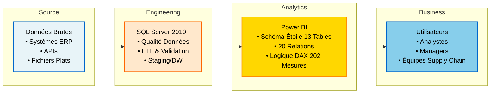

# PHARMA LOGISTICS - Tableau de Bord Power BI
#### Par [Marc James Samson](https://www.linkedin.com/in/samson18/)

---

---

## APERÇU

**Pharma Logistics BI** est un tableau de bord complet de gestion de la chaîne d'approvisionnement pharmaceutique construit avec Power BI. Il offre une visibilité en temps réel sur les commandes, le transport, l'inventaire, la conformité qualité et la performance financière dans plusieurs régions et prestataires logistiques.

Conçu pour les responsables de chaîne d'approvisionnement, les coordinateurs logistiques et les analystes financiers pour surveiller les KPI, identifier les goulets d'étranglement et optimiser les opérations de distribution pharmaceutique.

### FONDATION DES DONNÉES ET GOUVERNANCE

Ce projet démontre les pratiques d'ingénierie des données de niveau entreprise appliquées à l'analytique de chaîne d'approvisionnement pharmaceutique :

**Ingénierie des données :**

- Source : Ensemble de données entièrement conçu et architecturé à partir de zéro en suivant les meilleures pratiques du secteur
- Couche de données : Importée dans SQL Server 2019+ pour transformation et validation rigoureuse en utilisant des contraintes et des relations
- Traitement en amont : Tous les nettoyages de données, enrichissements et validations de qualité sont effectués au niveau SQL avant d'atteindre Power BI. Suivant le principe : « Effectuez les transformations de données aussi loin en amont (près de la source) que possible, et seulement en aval (dans le rapport) si nécessaire » (Maxime de Roche). Cela garantit l'intégrité des données, maintient une source unique de vérité et optimise les performances des rapports.

- Règles de validation standardisées appliquées pendant l'ETL
- **13 tables de données avec 20 relations** (architecture de schéma en étoile)
- 202 mesures calculées pour des définitions de KPI cohérentes

Cette approche upstream-first garantit l'intégrité des données sur plus de 822 000+ enregistrements couvrant 4 régions, 44 pays, 44 entrepôts et 2 535 clients mondialement.

---

## Diagramme d'Architecture

---

## &nbsp;&nbsp;&nbsp;Architecture des Bases de Données

Le système est construit sur une base de données SQL Server 2019+ avec **13 tables**, où tous les nettoyages de données, transformations, calculs métier, contraintes d'intégrité référentielle et définitions de relations sont appliquées à la couche données. Cette architecture upstream-first garantit la cohérence des données, élimine les traitements redondants dans la couche analytique et optimise les performances globales.

[Consulter DATABASE_SCHEMA.md complet](docs/DATABASE_SCHEMA.md) | [Dictionnaire des Données](docs/DATA_DICTIONARY.md)

---

###  &nbsp;&nbsp;&nbsp;Power Query

---

###  &nbsp;&nbsp;&nbsp;Diagramme du Schéma de Base de Données

Le diagramme ci-dessus illustre le modèle de données complet avec toutes les relations d'entités, incluant Commandes, Transport, Inventaire, Entrepôts, Transporteurs, Produits et Retours.

## PAGES DU TABLEAU DE BORD

&nbsp;&nbsp;&nbsp;**APERÇU** - Tableau de Bord Global de Performance

---

&nbsp;&nbsp;&nbsp;**PERFORMANCE** - Analytique de Chaîne d'Approvisionnement

---

&nbsp;&nbsp;&nbsp;**ENTREPÔTS** - Optimisation de l'Inventaire

---

&nbsp;&nbsp;&nbsp;**FINANCIER** - Rentabilité & Économie

---

## KPI PAR CATÉGORIE

### Aperçu Rapide des KPI

### KPI Clés de Transport
*Métriques suivi l'efficacité des transports, la performance logistique et la durabilité opérationnelle.*

| Nom du KPI | Description | Portée |
| :--- | :--- | :--- |
| **OTIF %** | Taux de Livraison à l'Heure et Complet | 🌍 Global |
| **Délai de Livraison** | Jours moyens de la commande à la livraison | 🚚 Logistique |
| **Coût par KM** | Métrique d'efficacité de transport | 💰 Financier |
| **Émissions CO2** | Empreinte environnementale par KM | 🌱 ESG |

### KPI Clés d'Entrepôt
*Métriques analysant l'optimisation de l'inventaire, la gestion du stock et la productivité des entrepôts.*

| Nom du KPI | Description | Portée |
| :--- | :--- | :--- |
| **Jours en Stock (DOH)** | Analyse de durée d'entreposage | 📉 Risque |
| **Rotation d'Inventaire** | COGS / Valeur Moyenne d'Inventaire | 🔄 Efficacité |
| **Risque d'Expiration (GBP)** | Impact financier du stock expirant | 💰 Financier |
| **Stock Mort %** | Pourcentage d'inventaire non-mobile | 📉 Risque |

### KPI Clés de Performance
*Métriques suivi l'efficacité opérationnelle, la conformité qualité et la précision des prévisions.*

| Nom du KPI | Description | Domaine de Focus |
| :--- | :--- | :--- |
| **Conformité Chaîne Froide %** | Pourcentage d'expéditions en température contrôlée | ❄️ Assurance Qualité |
| **MAPE** | Erreur Moyenne Absolue en Pourcentage (Précision des prévisions) | 📊 Planification de la Demande |
| **Excursions de Température** | Nombre et sévérité des incidents thermiques | ⚠️ Gestion des Risques |
| **Efficacité Chaîne d'Approvisionnement** | Score composite (0-100%) des opérations | ⚙️ Opérations |
| **Score de Conformité** | Score d'audit de conformité (0-100%) | ✅ Conformité |
| **Taux de Retour %** | Produits retournés par rapport aux commandes totales | 🔄 Logistique Inverse |
| **Biais de Prévision** | Tendance de sur/sous-estimation | 📈 Planification |
| **Temps de Résolution d'Excursion** | Heures moyennes pour résoudre les incidents thermiques | ⚡ Agilité |

### KPI Clés Financiers
*Indicateurs économiques mesurant la rentabilité, le coût de service et la valeur d'inventaire.*

| Nom du KPI | Description | Impact Commercial |
| :--- | :--- | :--- |
| **Marge Brute %** | Ratio de rentabilité `(Rev - COGS) / Rev` | � Rentabilité |
| **Coût Logistique Total** | Transport + Frais de stockage d'inventaire combinés | 💸 Contrôle des Coûts |
| **Contribution Nette** | Bénéfice net après tous les coûts | 💰 Santé du P&L |
| **Coût Logistique %** | Frais généraux logistiques relatifs aux revenus | 📊 Efficacité |
| **Coût de Stockage d'Inventaire** | Coût annuel de stockage et capital immobilisé | 💼 Fonds de Roulement |
| **Impact des Ruptures de Stock** | Perte de revenu estimée par les ruptures | 🎯 Coût d'Opportunité |
| **Coût des Biens Vendus** | COGS Total (MTD, YTD, YoY) | 📋 Comptabilité |
| **Risque d'Expiration (GBP)** | Valeur financière de l'inventaire à risque | ♻️ Gestion des Déchets |

Documentation Complète des 61 KPI : Voir [docs/KPIs.md](docs/KPIs.md) pour voir l'intégralité des KPI proposés.

---

## MÉTRIQUES DU PROJET

| Métrique | Valeur |
|--------|-------|
| Pages du Tableau de Bord | 4 |
| Nombre de Visuels | 20+ (empilés/superposés, équivalent à 9-10 pages) |
| Tableaux de Données | 13 |
| Tableaux de Mesures | 5 |
| Mesures Totales | 202 |
| Relations | 20 |
| Taille du Fichier Rapport | ~150MB |
| Régions Couvertes | 4 |
| Pays Inclus | 44 |
| Entrepôts Suivis | 44 |
| Transporteurs Suivis | 7 |
| Fournisseurs Suivis | 20 |
| Produits Suivi | 31 |
| Catégories de Produits | 6 |
| Modes de Transport | 4 |
| Commandes Suivies | 9 980 |
| Clients Suivis | 2 535 |
| Excursions de Température | 2 |
| Volume de Données | 822 000+ enregistrements |
| Période de Rétention des Données | 2023-2025 (3 ans) |
| Temps d'Actualisation | 16-20 secondes |

---

## DOCUMENTATION

###  Documentation du Projet

| Document | Description |
| :--- | :--- |
| [Guide d'Architecture](docs/ARCHITECTURE.md) | Architecture système, flux de données et décisions technologiques |
| **[Schéma de Base de Données](docs/DATABASE_SCHEMA.md)** | **Modèle de données, relations d'entités et structure de base de données** |
| [Documentation des KPI](docs/KPIs.md) | Définitions complètes des KPI, calculs et logique métier |
| [Dictionnaire des Données](docs/DATA_DICTIONARY.md) | Descriptions détaillées des champs et mappage des données |

---

## PILE TECHNOLOGIQUE

| Composant | Technologie | Version |
|-----------|-----------|---------|
| Plateforme BI | Power BI Desktop | 2.149.1429.0 |
| Transformation de Données | Power Query | 2.149.1429.0 |
| Analyse & Optimisation | DAX Studio | 3.2.1 |
| IDE | Visual Studio Code | 1.107.0 |
| Feuille de Calcul | Microsoft Excel | 2511 |
| Base de Données | SQL Server | 2019+ (SQLEXPRESS) |
| Gestion Base de Données | SQL Server Management Studio | 21.6.17 |

---

## LICENCE

Ce projet est concédé sous une **Licence Propriétaire et Confidentielle**.
Ce projet n'est PAS open-source et est proposé uniquement pour une licence commerciale.

Pour les demandes de licence : https://www.linkedin.com/in/samson18/

Voir le fichier [LICENSE](LICENSE) pour les termes juridiques complets.

---

## SUPPORT

Veuillez contacter : https://www.linkedin.com/in/samson18/

---

**Version :** 1.0.0
**Dernière mise à jour :** Décembre 2025
**Auteur :** Marc James Samson
**Statut :** Production Ready
**Licence :** Propriétaire et Confidentielle

---

&nbsp;&nbsp;&nbsp;&nbsp;&nbsp;
&nbsp;&nbsp;&nbsp;&nbsp;&nbsp;

