# PHARMA LOGISTICS - Power BI Dashboard
#### By [Marc James Samson](https://www.linkedin.com/in/samson18/)

---

---

## OVERVIEW

**Pharma Logistics BI** is a comprehensive pharmaceutical supply chain management dashboard built with Power BI. It provides real-time visibility into orders, transportation, inventory, quality compliance, and financial performance across multiple regions and logistics providers.

Designed for supply chain managers, logistics coordinators, and financial analysts to monitor KPIs, identify bottlenecks, and optimize pharmaceutical distribution operations.

### DATA FOUNDATION & GOVERNANCE

This project demonstrates enterprise-grade data engineering practices applied to pharmaceutical supply chain analytics:

**Dataset Engineering:**

- Source: Entire dataset designed and architected from scratch following industry best practices
- Data Layer: Imported into SQL Server 2019+ for rigorous transformation and validation using constraints and relationships
- Upstream Processing: All data cleansing, enrichment, and quality validations are performed at the SQL layer before reaching Power BI. Following the principle: "Perform data transformations as far upstream (close to the source) as possible, and only downstream (in the report) when necessary" (Roche's Maxim). This ensures data integrity, maintains a single source of truth, and optimizes report performance.

- Standardized validation rules applied during ETL
- 13 data tables with 20 active relationships (star schema architecture)
- 302 calculated measures for consistent KPI definitions
This upstream-first approach guarantees data integrity across 822,000+ records spanning 4 regions, 44 countries, 44 warehouses, and 2,535 customers globally.
---

## 🏗️ Architecture Diagram

```mermaid
graph LR
    subgraph "Source"
    A["Raw Data<br/>• ERP Systems<br/>• APIs<br/>• Flat Files"]
    end
    
    subgraph "Engineering"
    B["SQL Server 2019+<br/>• Data Quality<br/>• ETL & Validation<br/>• Staging/DW"]
    end
    
    subgraph "Analytics"
    C["Power BI<br/>• Star Schema 13 Tables<br/>• 20 Active Relationships<br/>• DAX Logic 302 Measures"]
    end
    
    subgraph "Business"
    D["Users<br/>• Analysts<br/>• Managers<br/>• Supply Chain Teams"]
    end

    A --> B
    B --> C
    C --> D
    
    style A fill:#e8f4f8,stroke:#0066cc,stroke-width:2px,color:#000
    style B fill:#ffe8cc,stroke:#ff6600,stroke-width:2px,color:#000
    style C fill:#ffd700,stroke:#ff8c00,stroke-width:2px,color:#000
    style D fill:#87ceeb,stroke:#0066cc,stroke-width:2px,color:#000
```

---

## DOCUMENTATION

###  Project Documentation

| Document | Description |
| :--- | :--- |
| [ Architecture Guide](docs/ARCHITECTURE.md) | System architecture, data flow, and technology decisions |
| **[ Database Schema](docs/DATABASE_SCHEMA.md)** | **Data model, entity relationships, and database structure** |
| [ KPIs Documentation](docs/KPIs.md) | Complete KPI definitions, calculations, and business logic |
| [ Data Dictionary](docs/DATA_DICTIONARY.md) | Detailed field descriptions and data mapping |

###  Database Schema Diagram

The above diagram illustrates the complete data model with all entity relationships, including Orders, Shipments, Inventory, Warehouses, Carriers, Products, and Transactions.

---

## DASHBOARD PAGES

📊 **OVERVIEW** - Global Performance Dashboard

---

📈 **PERFORMANCE** - Supply Chain Analytics

---

🏭 **WAREHOUSES** - Inventory Optimization

---

💰 **FINANCIAL** - Profitability & Economics

---

## KPI BY CATEGORY

### Quick KPI Overview

### 📦 Key Transport KPIs
| KPI Name | Description | Scope |
| :--- | :--- | :--- |
| **OTIF %** | On-Time In-Full Delivery Rate | 🌍 Global |
| **Lead Time** | Average days from order to delivery | 🚚 Logistics |
| **Cost per KM** | Transport efficiency metric | 💰 Financial |
| **CO2 Emissions** | Environmental footprint per KM | 🌱 ESG |

### 🏭 Key Warehouse KPIs
| KPI Name | Description | Scope |
| :--- | :--- | :--- |
| **Days on Hand (DOH)** | Stock duration analysis | 📉 Risk |
| **Inventory Turns** | COGS / Average Inventory Value | 🔄 Efficiency |
| **Expiry Risk (GBP)** | Financial impact of expiring stock | 💰 Financial |
| **Dead Stock %** | Non-moving inventory percentage | 📉 Risk |

### ⚙️ Key Performance KPIs
*Metrics tracking operational efficiency, quality compliance, and forecast accuracy.*

| KPI Name | Description | Focus Area |
| :--- | :--- | :--- |
| **Cold Chain Compliance %** | Temperature-controlled shipments percentage | ❄️ Quality Assurance |
| **MAPE** | Mean Absolute Percentage Error (Forecast accuracy) | 📊 Demand Planning |
| **Temperature Excursions** | Count and severity of thermal incidents | ⚠️ Risk Mgmt |
| **Supply Chain Efficiency** | Composite score (0-100%) of overall operations | ⚙️ Operations |
| **Regulatory Score** | Compliance audit score (0-100%) | ✅ Compliance |
| **Return Rate %** | Products returned vs total orders | 🔄 Reverse Logistics |
| **Forecast Bias** | Over/Under estimation tendency | 📈 Planning |
| **Excursion Resolution Time** | Average hours to resolve thermal incidents | ⚡ Agility |

### 💰 Key Financial KPIs
*Economic indicators measuring profitability, cost-to-serve, and inventory value.*

| KPI Name | Description | Business Impact |
| :--- | :--- | :--- |
| **Gross Margin %** | Profitability ratio `(Rev - COGS) / Rev` | 📈 Profitability |
| **Total Logistics Cost** | Transport + Inventory holding combined | 💸 Cost Control |
| **Net Contribution** | Bottom line profit after all costs | 💰 P&L Health |
| **Logistics Cost %** | Logistics overhead relative to revenue | 📊 Efficiency |
| **Inventory Holding Cost** | Annual cost of storage & capital tied up | 💼 Working Capital |
| **Stock-out Impact** | Estimated revenue loss from stockouts | 🎯 Opportunity Cost |
| **Cost of Goods Sold** | Total COGS (MTP, YTD, YoY) | 📋 Accounting |
| **Expiry Risk (GBP)** | Financial value of at-risk inventory | ♻️ Waste Mgmt |

📊 Full KPI Documentation of 61 KPIs: See [docs/KPIs.md](docs/KPIs.md) to view the complete list of proposed KPIs.

---

## PROJECT METRICS

| Metric | Value |
|--------|-------|
| Dashboard Pages | 4 |
| Visuals Count | 20+ (stacked/overlaid, equivalent to 9-10 pages) |
| Data Tables | 13 |
| Measure Tables | 5 |
| Total Measures | 302 |
| Relationships | 20 |
| Report File Size | ~150MB |
| Regions Covered | 4 |
| Countries Included | 44 |
| Warehouses Tracked | 44 |
| Carriers Tracked | 7 |
| Suppliers Tracked | 20 |
| Products Tracked | 31 |
| Categories of Products | 6 |
| Transport Modes | 4 |
| Orders Tracked | 9,980 |
| Customers Tracked | 2,535 |
| Temperature Excursions | 2 |
| Data Volume | 822,000+ records |
| Data Retention Period | 2023-2025 (3 years) |
| Refresh Time | 16-20 seconds |

---

## TECHNOLOGY STACK

| Component | Technology | Version |
|-----------|-----------|---------|
| BI Platform | Power BI Desktop | 2.149.1429.0 |
| Data Transformation | Power Query | 2.149.1429.0 |
| Analysis & Optimization | DAX Studio | 3.2.1 |
| IDE | Visual Studio Code | 1.107.0 |
| Spreadsheet | Microsoft Excel | 2511 |
| Database | SQL Server | 2019+ (SQLEXPRESS) |
| Database Management | SQL Server Management Studio | 21.6.17 |

---

## LICENSE

This project is licensed under a **Proprietary and Confidential License**.
This project is NOT open-source and is offered for commercial licensing only.

For licensing inquiries: https://www.linkedin.com/in/samson18/

See [LICENSE](LICENSE) file for complete legal terms.

---

## SUPPORT

Please contact: https://www.linkedin.com/in/samson18/

---

**Version:** 1.0.0
**Last Updated:** December 2025
**Author:** Marc James Samson
**Status:** Production Ready
**License:** Proprietary and Confidential

---

