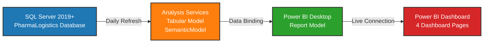
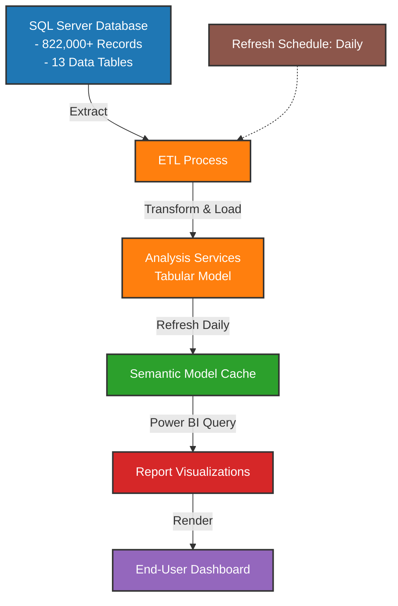

# Architecture Overview

## System Architecture

The Pharma Logistics BI solution follows a modern three-tier data architecture connecting operational data sources to business analytics dashboards.

## Data Flow & Refresh Cycle

## Component Details

### Data Source Layer

**SQL Server 2019+** (PharmaLogistics Database)
- Primary operational database
- Contains 13 fact and dimension tables
- 822,000+ records across 4 regions
- Data coverage: 44 countries, 44 warehouses
- Supports real-time queries and scheduled refreshes

**Key Tables:**
- `Shipments` - Transportation records
- `Warehouse_Movements` - Inventory operations
- `Regions` - Geographic dimensions
- `Products` - Pharmaceutical product catalog
- `Customers` - Distribution network nodes

### Semantic Layer

**Analysis Services Tabular Model** (SemanticModel)
- Purpose: Data aggregation and business logic
- Model Type: Tabular (in-memory analytics)
- Compatibility Level: 1700+
- Data Refresh: Daily scheduled
- Caching: In-memory with query optimization

**Model Components:**
- **20 Active Relationships** between tables
- **302 Calculated Measures** including:
  - KPI calculations
  - Financial aggregations
  - Performance metrics
- **User Hierarchies:**
  - Geographic hierarchy (Region -> Country -> Warehouse)
  - Time hierarchy (Year -> Month -> Day)
  - Product hierarchy (Category -> Product)

### Presentation Layer

**Power BI Desktop Report Model** (Pharma Logistics.pbix)
- 4 Dashboard pages with 413 interactive visuals
- Live connection to Analysis Services
- Custom visuals and advanced formatting
- Bookmark navigation for user experience

#### Dashboard Pages

1. **Overview Page**
   - 100 visuals
   - Executive summary metrics
   - KPI cards and gauges
   - Geographic distribution maps
   - Real-time status indicators

2. **Warehouses Page**
   - 107 visuals
   - Inventory levels by warehouse
   - Movement patterns and trends
   - Storage efficiency metrics
   - Warehouse performance comparisons

3. **Performance Page**
   - 106 visuals
   - Operational KPIs
   - Service level agreements (SLA) tracking
   - Delivery performance analysis
   - Transit time metrics

4. **Financial Page**
   - 100 visuals
   - Revenue and cost analysis
   - Margin calculations
   - Budget vs. actual comparisons
   - Financial performance trends

## KPI Architecture

**61 KPIs** organized across 4 categories:

### Transport KPIs (16)
- On-time delivery rate
- Average transit time
- Freight cost per unit
- Vehicle utilization rate
- Delivery distance optimization

### Warehouse KPIs (18)
- Inventory turnover rate
- Storage utilization rate
- Order fulfillment time
- Warehouse operation cost
- Stock accuracy rate

### Performance KPIs (15)
- Overall equipment effectiveness (OEE)
- Process adherence rate
- Quality score
- Productivity metrics
- Compliance indicators

### Financial KPIs (12)
- Total logistics cost
- Cost per shipment
- Revenue per region
- Margin by product
- ROI metrics

## Technologies Stack

| Component | Technology | Version |
|-----------|-----------|---------|
| **Database** | SQL Server | 2019+ |
| **Semantic Model** | Analysis Services (Tabular) | 2022+ |
| **BI Platform** | Power BI Desktop | Latest |
| **Refresh Engine** | Analysis Services Refresh | Scheduled Daily |
| **Reporting** | Power BI Service | Cloud-based |

## Data Refresh & Maintenance

### Refresh Schedule
- **Frequency:** Daily
- **Time:** Off-peak hours (after business close)
- **Duration:** 15-30 minutes typical
- **Trigger:** Scheduled refresh + on-demand capability

### Maintenance Tasks
- Daily: Data refresh from SQL Server
- Weekly: Data quality validation
- Monthly: Performance optimization and indexing
- Quarterly: Model review and KPI validation

## Security Architecture

### Data Security
- SQL Server integrated authentication
- Analysis Services role-based security (RLS)
- Row-level security (RLS) by region and user
- Connection string encryption

### Access Control
- Power BI Azure AD integration
- Workspace-level permissions
- Row-level security filters
- Audit logging enabled

## Performance Considerations

### Query Optimization
- Tabular model uses in-memory engine (Vertipaq)
- Calculation engine optimized for DAX
- Materialized aggregations for large datasets
- Compression ratio: Typical 10:1 from source

### Scalability
- Supports growing data volume (currently 822K+ records)
- Analysis Services can handle millions of records
- Partitioning strategy for large fact tables
- Incremental refresh capability for efficiency

## Integration Points

### Data Integration
- **SQL Server** <-> **Analysis Services** (XMLA protocol)
- **Analysis Services** <-> **Power BI** (DAX queries)
- **Power BI** <-> **Power BI Service** (cloud sync)

### External Connections
- Azure Key Vault for credentials (recommended)
- Service Principal for automated refresh
- Power BI Gateway for on-premises connectivity (if applicable)

## Disaster Recovery

### Backup Strategy
- SQL Server: Full backup + transaction logs
- Analysis Services: Model metadata backup
- Power BI: Report definitions in source control
- Retention: 30-day rolling backup window

### Recovery Procedures
- Database restore: Standard SQL Server procedure
- Model restore: TMSL script deployment
- Report restore: Git-based version control

## Future Enhancements

- Real-time data streaming (if required)
- Advanced ML predictive analytics
- Geospatial analysis expansion
- Mobile-optimized dashboards
- API layer for third-party integrations

---

**Last Updated:** December 2025  
**Documentation Version:** 2.0  
**Status:** Current

