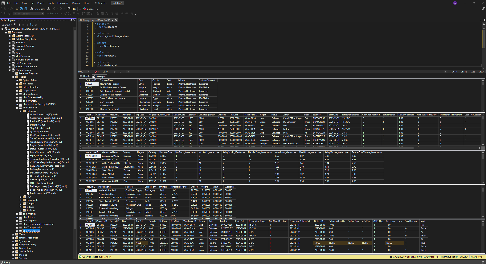

# Database Schema & Data Model

## Overview

This document describes the database schema and data relationships for the Pharma Logistics BI system. The data model supports comprehensive tracking and analytics across the pharmaceutical supply chain including inventory management, transportation, warehousing, and financial metrics.

---

## &nbsp;&nbsp;&nbsp;Database Architecture



The system is built on a SQL Server database with **13 tables** organized as:

**Fact Tables** (9.8K+ transaction records)
- Orders
- Transportation
- Inventory
- TemperatureExcursions
- ForecastWeekly
- Returns

**Dimension Tables** (Reference data)
- Customers
- Warehouses
- Products
- Suppliers
- DIM_Carrier
- Date (Calendar)
- v_LeadTime_Orders (Analytics view)

---

## &nbsp;&nbsp;&nbsp;Entity Relationship Diagram (ERD)

The following diagram illustrates the relationships between all major entities in the pharma logistics database:


---

## Core Entities

### **1. Orders**
- Unique order identifiers
- Order dates and delivery windows
- Customer information
- Order status tracking

### **2. Shipments**
- Shipment tracking information
- Carrier assignments
- Temperature and compliance monitoring
- Transit details (origin, destination, route)

### **3. Inventory**
- Stock keeping units (SKUs)
- Warehouse locations
- Batch tracking and expiry dates
- Quantity on hand and reserved stock

### **4. Warehouses**
- Warehouse locations globally (44 warehouses)
- Storage capacity
- Operational metrics
- Regional assignments

### **5. Carriers**
- Carrier information (7 tracked carriers)
- Performance metrics
- Service level agreements
- Cost rates

### **6. Products**
- Product catalog (6 categories)
- Product attributes
- Regulatory classifications
- Cost and pricing information

### **7. Transactions**
- Daily transaction records
- Financial entries
- Compliance documentation
- Audit trails

---

## Key Relationships

**Total: 20 Relationships (15 Active + 5 Inactive)**

| From Table | From Column | To Table | To Column | Cardinality | Status |
| :--- | :--- | :--- | :--- | :---: | :---: |
| **Orders** | CustomerID | Customers | CustomerID | N:1 | ✅ Active |
| **Orders** | ProductID | Products | ProductID | N:1 | ✅ Active |
| **Orders** | WarehouseID | Warehouses | WarehouseID | N:1 | ✅ Active |
| **Orders** | Date | Date | Date | N:1 | ✅ Active |
| **Orders** | OrderID | Returns | OrderID | N:1 | ✅ Active |
| **Orders** | OrderID | TemperatureExcursions | OrderID | N:1 | ✅ Active |
| **Transportation** | OrderID | Orders | OrderID | N:1 | ✅ Active |
| **Transportation** | Carrier | DIM_Carrier | Carrier | N:1 | ✅ Active |
| **Inventory** | ProductID | Products | ProductID | N:1 | ✅ Active |
| **Inventory** | WarehouseID | Warehouses | WarehouseID | N:1 | ✅ Active |
| **Products** | SupplierID | Suppliers | SupplierID | N:1 | ✅ Active |
| **ForecastWeekly** | ProductID | Products | ProductID | N:1 | ✅ Active |
| **ForecastWeekly** | WarehouseID | Warehouses | WarehouseID | N:1 | ✅ Active |
| **v_LeadTime_Orders** | Carrier | DIM_Carrier | Carrier | N:1 | ✅ Active |
| **v_LeadTime_Orders** | OrderDate | Date | Date | N:1 | ✅ Active |
| **ForecastWeekly** | WeekStart | Date | Date | N:1 | ❌ Inactive |
| **v_LeadTime_Orders** | DeliveryDate | Date | Date | N:1 | ❌ Inactive |
| **v_LeadTime_Orders** | ShipDate | Date | Date | N:1 | ❌ Inactive |
| **v_LeadTime_Orders** | WarehouseID | Warehouses | WarehouseID | N:1 | ❌ Inactive |
| **Orders** | Region | v_LeadTime_Orders | Region | N:1 | ❌ Inactive |

---

## Data Flow

```
Orders → Transportation → DIM_Carrier
   ↓
Customers, Products, Warehouses, Date
   ↓
Returns, TemperatureExcursions
   ↓
Inventory, ForecastWeekly
   ↓
Suppliers
```

---

## Data Quality Standards

- ✅ All foreign keys validated
- ✅ Referential integrity enforced
- ✅ Unique constraints on business keys
- ✅ Audit timestamps on all transactional data
- ✅ Data normalization (3NF)

---

## Related Documentation

- 📊 [KPIs Documentation](./KPIs.md) - Comprehensive KPI definitions
- 🏗️ [Architecture Guide](./ARCHITECTURE.md) - System architecture overview
- 📖 [Data Dictionary](./DATA_DICTIONARY.md) - Detailed field descriptions

---

**Last Updated:** December 2025  
**Schema Version:** 1.0.0
