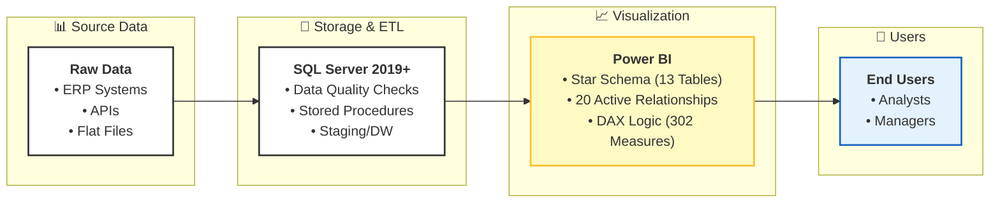

## Mermaid Architecture Diagram

```mermaid
graph LR
    subgraph Source["📊 Source Data"]
    A["<b>Raw Data</b><br/>• ERP Systems<br/>• APIs<br/>• Flat Files"]
    end
    
    subgraph ETL["🔄 Storage & ETL"]
    B["<b>SQL Server 2019+</b><br/>• Data Quality Checks<br/>• Stored Procedures<br/>• Staging/DW"]
    end
    
    subgraph BI["📈 Visualization"]
    C["<b>Power BI</b><br/>• Star Schema (13 Tables)<br/>• 20 Active Relationships<br/>• DAX Logic (302 Measures)"]
    end
    
    subgraph Users["👥 Users"]
    D["<b>End Users</b><br/>• Analysts<br/>• Managers"]
    end

    A --> B
    B --> C
    C --> D
    
    style A fill:#ffffff,stroke:#333,stroke-width:2px
    style B fill:#ffffff,stroke:#333,stroke-width:2px
    style C fill:#fff9c4,stroke:#fbc02d,stroke-width:2px
    style D fill:#e3f2fd,stroke:#1565c0,stroke-width:2px
```
